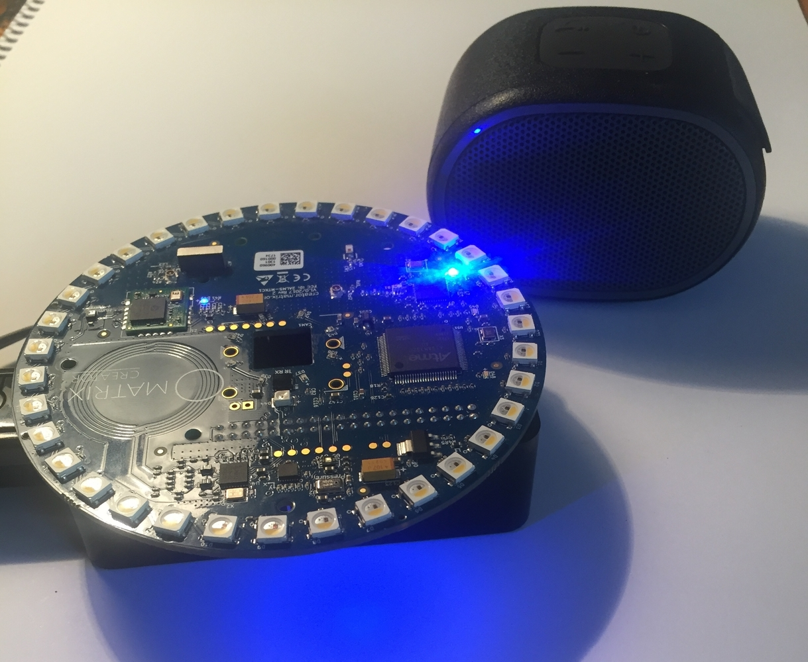

# Voice Assistant

### Description 
The Voice Assistant is a voice controlled device that can assist you with a wide variety of task’s such as 
controlling a television or smart home device, reading or sending emails, playing music, receiving news and weather updates.

This hardware of the device consist of a Raspberry Pi 3 Model B+ with a Matrix Creator development board which is the 
wireless communication sender and receiver and also is the systems microphone. 

The system is written in primarily Python and bash. 

### Functions 
  * Translate language
  * Infrared receiver & transmittor 
  * Control Zigbee smart home devices
  * Play music 
  * Send & receieve emails 
  * Search wikipedia 
  * Get the weather 
  * Get the news forecast 
  * Take pictures

### Video Walkthrough 
A video walkthrough demonstrating the project - https://drive.google.com/file/d/1XBtgMACg_ceIX6kvUlAV8xBUFLYGQ17X/view
  

### Final system design

